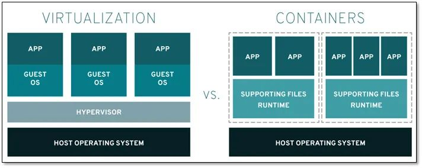
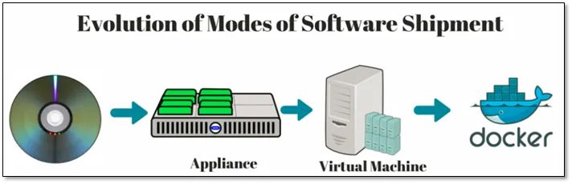
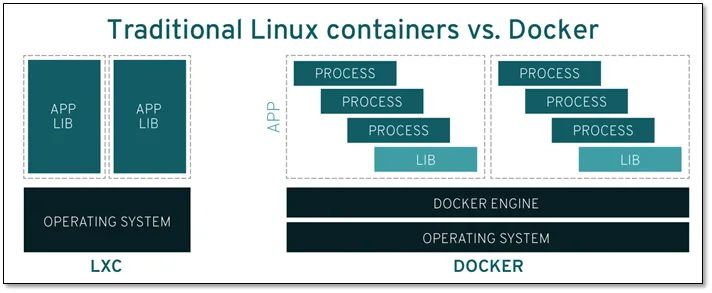

# Docker 简介

> [以下内容来自腾讯云的教程](https://cloud.tencent.com/developer/article/1885678)

## 1.1 什么是 Linux 容器
Linux容器是与系统其他部分隔离开的一系列进程，从另一个镜像运行，并由该镜像提供支持进程所需的全部文件。容器提供的镜像包含了应用的所有依赖项，因而在从开发到测试再到生产的整个过程中，它都具有可移植性和一致性。  
  

- 更加详细地来说，请您假定您在开发一个应用。您使用的是一台笔记本电脑，而且您的开发环境具有特定的配置。其他开发人员身处的环境配置可能稍有不同。您正在开发的应用依赖于您当前的配置，还要依赖于某些特定文件。与此同时，您的企业还拥有标准化的测试和生产环境，且具有自身的配置和一系列支持文件。您希望尽可能多在本地模拟这些环境，而不产生重新创建服务器环境的开销。

- 因此，您要如何确保应用能够在这些环境中运行和通过质量检测，并且在部署过程中不出现令人头疼的问题，也无需重新编写代码和进行故障修复？答案就是使用容器。容器可以确保您的应用拥有必需的配置和文件，使得这些应用能够在从开发到测试、再到生产的整个流程中顺利运行，而不出现任何不良问题。这样可以避免危机，做到皆大欢喜。

虽然这只是简化的示例，但在需要很高的可移植性、可配置性和隔离的情况下，我们可以利用 Linux 容器通过很多方式解决难题。无论基础架构是在企业内部还是在云端，或者混合使用两者，容器都能满足您的需求。  

## 1.2 容器不就是虚拟化吗
是，但也不竟然。我们用一种简单方式来思考一下：   

- 虚拟化使得许多操作系统可同时在单个系统上运行。    

- 容器则可共享同一个操作系统内核，将应用进程与系统其他部分隔离开。

这意味着什么？首先，让多个操作系统在单个虚拟机监控程序上运行以实现虚拟化，并不能达成和使用容器同等的轻量级效果。事实上，在仅拥有容量有限的有限资源时，您需要能够可以进行密集部署的轻量级应用。Linux 容器可从单个操作系统运行，在所有容器中共享该操作系统，因此应用和服务能够保持轻量级，并行快速运行。

## 1.3 容器发展简史

- 我们现在称为容器技术的概念最初出现在 2000 年，当时称为 FreeBSD jail，这种技术可将 FreeBSD 系统分区为多个子系统（也称为 Jail）。Jail 是作为安全环境而开发的，系统管理员可与企业内部或外部的多个用户共享这些 Jail。

- Jail 的目的是让进程在经过修改的 chroot 环境中创建，而不会脱离和影响整个系统 — 在 chroot 环境中，对文件系统、网络和用户的访问都实现了虚拟化。尽管 Jail 在实施方面存在局限性，但最终人们找到了脱离这种隔离环境的方法。

- 但这个概念非常有吸引力。

- 2001 年，通过 Jacques Gélinas 的 VServer 项目，隔离环境的实施进入了 Linux 领域。正如 Gélinas 所说，这项工作的目的是“在高度独立且安全的单一环境中运行多个通用 Linux 服务器 [sic]。” 在完成了这项针对 Linux 中多个受控制用户空间的基础性工作后，Linux 容器开始逐渐成形并最终发展成了现在的模样。

# 2 什么是 Docker？
“Docker” 一词指代多种事物，包括开源社区项目、开源项目使用的工具、主导支持此类项目的公司 Docker Inc. 以及该公司官方支持的工具。技术产品和公司使用同一名称，的确让人有点困惑。

我们来简单说明一下：

- IT 软件中所说的 “Docker” ，是指容器化技术，用于支持创建和使用 Linux 容器。
- 开源 Docker 社区致力于改进这类技术，并免费提供给所有用户，使之获益。
- Docker Inc. 公司凭借 Docker 社区产品起家，它主要负责提升社区版本的安全性，并将改进后的版本与更广泛的技术社区分享。此外，它还专门对这些技术产品进行完善和安全固化，以服务于企业客户。
- 借助 Docker ，您可将容器当做重量轻、模块化的虚拟机使用。同时，您还将获得高度的灵活性，从而实现对容器的高效创建、部署及复制，并能将其从一个环境顺利迁移至另一个环境。

## 2.1 Docker 如何工作？
- Docker 技术使用 Linux 内核和内核功能（例如 Cgroups 和 namespaces）来分隔进程，以便各进程相互独立运行。这种独立性正是采用容器的目的所在；它可以独立运行多种进程、多个应用程序，更加充分地发挥基础设施的作用，同时保持各个独立系统的安全性。

- 容器工具（包括 Docker）可提供基于镜像的部署模式。这使得它能够轻松跨多种环境，与其依赖程序共享应用或服务组。Docker 还可在这一容器环境中自动部署应用程序（或者合并多种流程，以构建单个应用程序）。

- 此外，由于这些工具基于 Linux 容器构建，使得 Docker 既易于使用，又别具一格 —— 它可为用户提供前所未有的高度应用程访问权限、快速部署以及版本控制和分发能力。

## 2.2 Docker 技术是否与传统的 Linux 容器相同？
否。Docker 技术最初是基于 LXC 技术构建（大多数人都会将这一技术与“传统的” Linux 容器联系在一起），但后来它逐渐摆脱了对这种技术的依赖。

- 就轻量级虚拟化这一功能来看，LXC 非常有用，但它无法提供出色的开发人员或用户体验。除了运行容器之外，Docker 技术还具备其他多项功能，包括简化用于构建容器、传输镜像以及控制镜像版本的流程。

- 传统的 Linux 容器使用 init 系统来管理多种进程。这意味着，所有应用程序都作为一个整体运行。与此相反，Docker 技术鼓励应用程序各自独立运行其进程，并提供相应工具以实现这一功能。这种精细化运作模式自有其优势。

## 2.3 docker的目标
docker的主要目标是"Build,Ship and Run any App,Angwhere",构建，运输，处处运行

- 构建：做一个docker镜像

- 运输：docker pull

- 运行：启动一个容器

- 每一个容器，他都有自己的文件系统rootfs.
