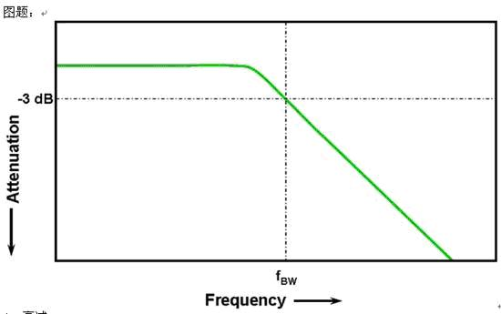
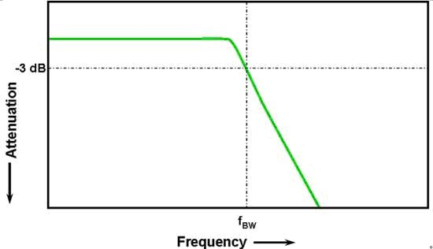

# ADC
[参考链接](https://baike.baidu.com/item/%E7%A4%BA%E6%B3%A2%E5%99%A8%E5%B8%A6%E5%AE%BD/7769464)
## 采样
- 单位 SPS (sample per second)，
每秒采样次数，是衡量模数转换(ADC)时**采样速率**的单位。
- **采样率**定义为对输入信号的采样频率，采样率不仅表示模数转换器的转换速度，同时也决定了系统可处理信号的**带宽范围**。

## 带宽
所有示波器都表现出在较高频率处滚降的**低通频率响应**。
- 大多数带宽参数在**1 GHz及以下**的示波器通常表现为**高斯响应**，
即具备约从-3 dB频率的三分之一处开始缓慢滚降的特性。

- 那些带宽规格**超过1 GHz**的示波器通常则具备**最大平坦频率响应**，
这种频响通常表现为带内响应较平缓，而在约-3 dB频率处滚降较陡。

示波器的**高斯响应**和**最大平坦频率响应**这两种频率响应各有各的优缺点。  

- 具备**最大平坦频响**的示波器比具备**高斯频响**的示波器对带内信号的衰减较小，也就是说前者对带内信号的测量更精确。

- 但具备**高斯频响**的示波器比具备**最大平坦频响**的示波器对带外信号的衰减小，也就是说在同样的带宽规格下，具备高斯频响的示波器通常具备更快的上升时间。

然而，有时对带外信号的衰减大有助于消除那些根据**奈奎斯特标准**(fMAX＜fS)可能造成混迭的高频成分。
> 关于 奈奎斯特采样理论更深入的探讨，请参看 安捷伦应用笔记1587(AgilentApplication Note 1587) 。  

不论的示波器具备**高斯频响**、**最大平坦频响**还是介于二者之间，
都将**输入信号通过示波器后衰减3 dB时的最低频率**视为该示波器的带宽。
示波器的带宽和频响可以利用正弦波信号发生器**扫频**测量得到。
信号在示波器-3dB频率处的衰减转换后可表示为约-30%的幅度误差。
因此，不能奢望对那些主要的频率成分接近示波器带宽的信号进行精确测量。
## 上升时间
## 存储深度