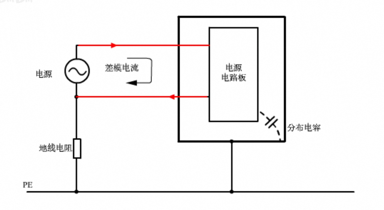
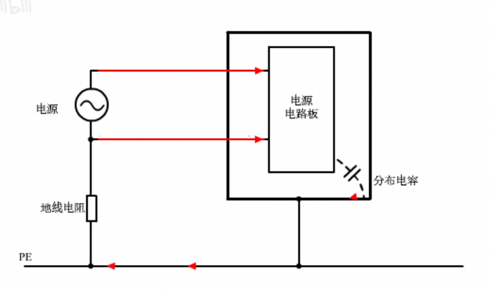
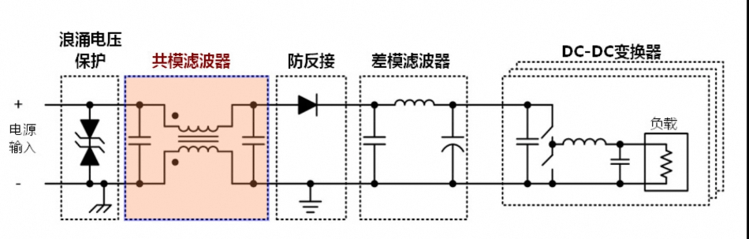
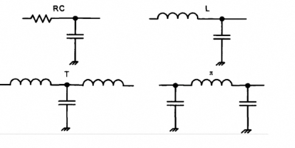
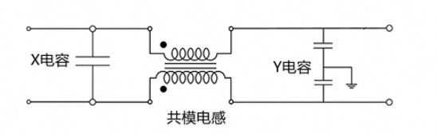
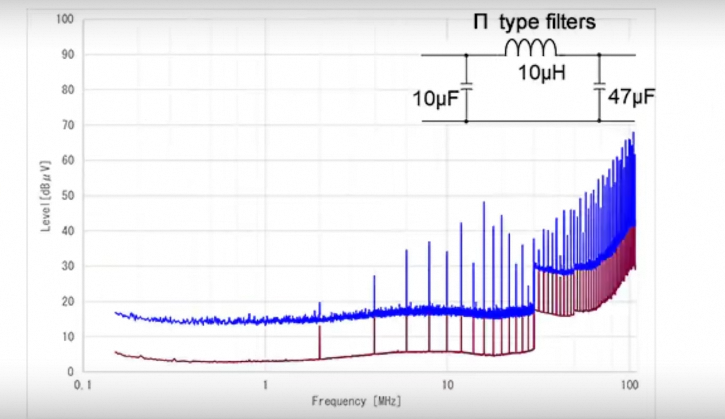
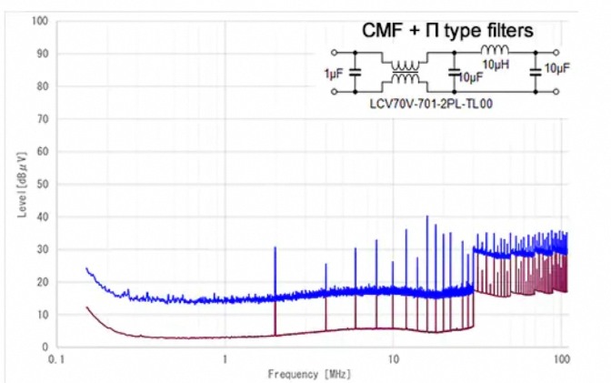

# 噪声
开关电源必须设置输入滤波器，防止电网的噪声干扰自己，防止干扰进入电网。
## 噪声的类型
1. 差模噪声
- 差模噪声的电流环路在电路的内部，比如电源转换器电路: 噪声从输入电源的一端流入转换器电路，然后从转换器电路流向电源的另一端，形成一个电流环路，在这一去一回的路径产生的噪声叫作差模噪声。

2. 共模噪声
- 电源转换电路安装在连接地线的机箱底盘上，在电路板和机箱外壳之间，以及机箱外壳与参考地之间，都存在分布电容。
- 电源转换电路产生的噪声电流，可以通过分布电容流向机箱的地线，并流回电源端，形成一个大的电流环路，这些在环路传导的噪声被称为共模噪声。

## 传播方式
传导
辐射
## 滤波
应对开关电源的关键是: 区分差模和共模噪声，分别进行处理。通常使用LC滤波器

### 差模噪声滤波器
是由电感和电容组成的低通滤波器，她连接到开关电源的输入端。

### 在共模噪声滤波器
共模电感也叫共模扼流圈，是关键元件。她是在共模噪声下起作用的电感，扼流圈的一端接输入电源，另一端接入开关电源电路，或者连接一个差模滤波器。
共模电感可以连接X电容或y电容构成共模LC滤波器

## 应用
实际应用中，共模滤波器和差模滤波器(如π型滤波器)串联使用，分别滤除共模和差模噪声。
> 举个例子
- 只使用差模滤波器不能降低50MHz以上的高频噪声，

- 当同时使用共模滤波器时，才可将50MHz以上的大部分噪声滤除 

## 共模电感的主要指标
1. 共模阻抗
    通常指100Mhz频率下的感抗，共模阻抗越大，对噪声的抑制效果越好。
2. 直流电阻
3. 额定电流
4. 额定电压
5. 两个线圈之间的隔离电阻 
    10MΩ以上。

