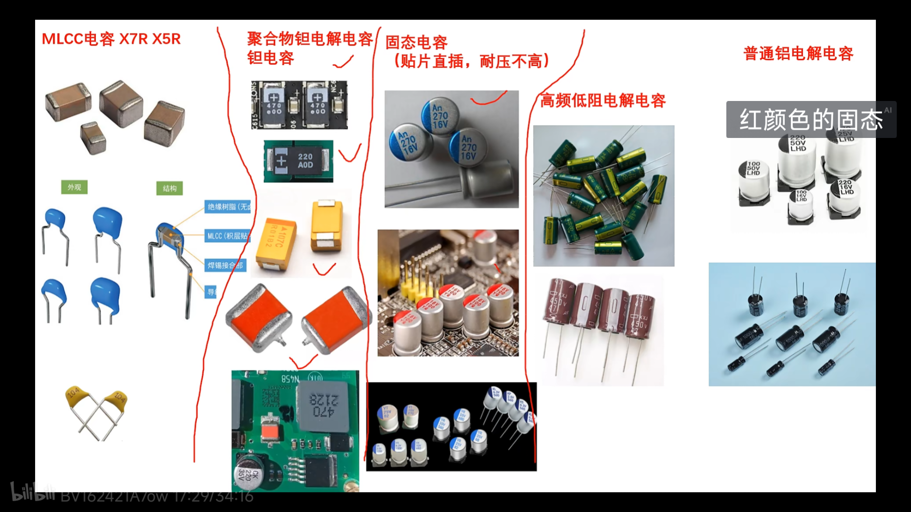

# 电容选型

### 举个例子
- Bluck芯片: XL7025

$$ C_{in} =\frac {I_{out-max} * V_{out}} 
{ΔV_{in} * F_{sw}* V_{in-min}} $$

小容量靠近芯片 0.1μF

## $C_{in}$:输入电容 
1. 大容量电容与小容量电容并联
2. 大容量越大越好
3. 小容量0.1μF的MLCC电容
4. 耐压 最小 大于1.5倍输入电压

### 输入大容量电容选型:
1. MLCC
2. 钽电容 
    > 最高不用 如果用要三倍耐压。
3. 固态电容
    > 耐压不高 最高35V
4. 高频低阻固态电容
5. 普通电解电容

## $V_{out}$:输出电容
1. 最好大容量电容和小容量电容并联
2. 小容量靠近芯片 0.1μF MLCC
    > COT架构输出电容不用MLCC 用的话串联0.2Ω电阻 容量至少10μF以上
    
### 选型
1. MLCC
2. 钽电容
    > 两倍耐压
3. 固态电容
4. 高频低阻电解电容
5. 普通电解电容
    > 不推荐
    
## 自举电容 
0.01μF - 1μF X7R MLCC 电容

## 电容实物图

- 高频低阻电解电容 绿色黄色
- 黑色钽电容

## 备注
1. MLCC选封装大 耐压高的电容 
2. 两个电容并联之后容量会变小 
    > 解决方案 :封装改大 比如1210_25V_22μF
3. 加电后电容量会比标称的低
    > 解决方案: 封装大 耐压高
4. pcb两层防止电容防止啸叫
5. 关于COT架构的BLUCK电路 $R_{ESR}$不能太小，太小会工作不正常。
