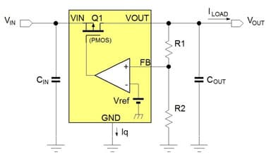

# 线性稳压器 (LDO)

当输出电压低于输入电压时，必须从负载电源和压降比来考虑要采用线性稳压器 (LDO) 或降压转换器 (Buck).

**低压降线性稳压器** (LDO) 适合用在需求低噪讯、低电流和低压降比的应用中。

LDO 透过线性的方式控制被动组件的导通来调节输出电压。线性稳压可提供**准确**而**无噪讯**的输出电压，并且对负载变化有很快的反应速度。

但线性稳压的作法，也代表输入输出间的压差乘上其平均负载电流会转换为 LDO 被动组件的功率耗散。功率耗散的计算如下：

$$P_D = (V_{IN} - V_{OUT}) × I_{LOAD}$$

可见，高压降比和高负载电流会产生较高的功率耗散。

愈高的**功率耗散**一般需要愈大的 LDO **封装尺寸**，这将增加整体成本、PCB面积，以及应用系统的运作温度。当 LDO 功率耗散高于 0.8W 左右时，转为使用降压转换器 (Buck) 是较明智的作法。

挑选 LDO 时，必须考虑输入和输出的电压范围、LDO的负载能力，以及芯片封装的功率耗散能力。LDO的输入输出电压差比需高于额定最小电压差(Dropout Voltage)，亦即 $V_{IN} - V_{OUT} > Droput Voltage$，否则 LDO 无法正常运作。

在微电力应用中(例如必须靠单一电池支持数年电力的产品)使用 LDO时，必须注意选用**低静态电流 (IQ)**的 LDO，以避免不必要的电力浪费。

输入电压 > 输出电压 + 压差
